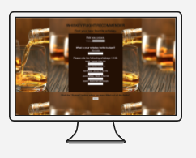

# The Whiskey Recommender

Tehera Nesfield
[Github](https://github.com/tnesfield) | [Linked in](https://www.linkedin.com/in/tehera-nesfield/) |
<a href = "mailto: tehera.nesfield@gmail.com">Email</a>

# The Whiskey Flight Recommender 
## Discover Your New Favorite Whiskey

## Whiskey
* “Whiskey” is a Gaelic word which means “water of life.”
* Scottish and Canadian whiskies are spelled without the “e” and the others are spelled with it -- whiskey.
* The earliest known record of Whiskey production dates back to 1494.
* Jack Daniel’s was the best selling whiskey in the US in 2019.
* 37% of whiskey drinkers are women.
* True whiskey drinkers don't add ice.

## Data

I webscraped this dataset from <a href="https://www.whiskybase.com//">whiskeybase.com</a>. I chose this site because I was able to gather user ratings for each bottle of whiskey. I focused on popular whiskey distilleries and bottles that were in their core range, rare and limited bottles are not included. 

## EDA

## Model

The Whiskey Recommender uses explicit filtering. It takes a user’s whiskey type and budget to filter the dataset. It then uses matrix factorization with SVD in Surprise to predict the user's rating. My model was tested and received a RMSE score of 4.3. For the final recommendation, it outputs the top 5 predicted bottles.

## Deployment

I deployed the recommender using Flask.

